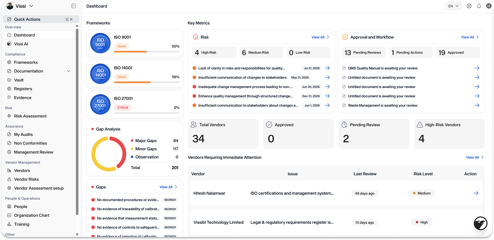

# Dashboard

The Dashboard is the first screen you see when you log in. It gives you a summary of your compliance program across all your frameworks, so you can quickly see what's on track and what needs attention.

***

<figure><figcaption></figcaption></figure>

### Frameworks

On the left side, you'll see a card for each framework your organisation manages (e.g. ISO 9001, ISO 14001, ISO 27001). Each card shows:

* The framework name and icon.
* A readiness status label (e.g. "Good", "Critical").
* A percentage score showing how far along your documentation and evidence are.

### Gap Analysis

Below the framework cards, a donut chart breaks down your total gaps across all frameworks into three categories:

* **Major Gaps** (red). Requirements where documentation or evidence is missing entirely.
* **Minor Gaps** (orange). Requirements where something exists but needs improvement.
* **Observations** (blue). Suggestions for improvement that won't block an audit.

### Gaps

Below the chart, individual gap findings are listed with a severity indicator and the framework they relate to. Click **View All** to see the full list. Each gap links through to more detail so you can assign owners and take action.

### Key Metrics: Risk

A summary of your risk register, grouped by severity: High Risk, Medium Risk, and Low Risk. Below the counts, individual risk items are listed with their due dates. Click any item or **View All** to go to Risk Assessment.

### Key Metrics: Approval and Workflow

Shows the status of documents moving through your review process: Pending Reviews, Pending Actions, and Approved. Below the counts, you'll see individual documents awaiting your review. Click any item to open it directly in Documentation, or click **View All** to see the full list.

### Vendor Summary

At the bottom right, four counts give you a snapshot of your vendor program: Total Vendors, Approved, Pending Review, and High-Risk Vendors.

Below that, a **Vendors Requiring Immediate Attention** table lists vendors with outstanding issues, their risk level, and when they were last reviewed. Click **View All** to go to Vendor Management.
