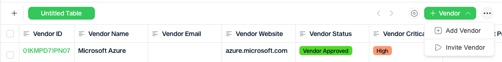

# Vendors

Vendors is where you manage your vendor relationships: onboard new vendors, review their submissions, and track their status over time.

### The vendor list

When you open Vendors, you'll see a table of all your vendors. You can create a new vendor from the **+ Vendor** button in the top-right corner.

<figure><figcaption></figcaption></figure>

The Vendors table with the **+ Vendor** menu.

Each vendor shows:

* **Vendor ID.** Automatically assigned.
* **Vendor Name** and **Email**.
* **Vendor Status.** Where they are in the process, for example **Created**, **Vendor Invited**, or **Approved Onboarding Form**.
* **Vendor Criticality.** How important this vendor is to your operations, for example High, Medium, or Low.
* **Vendor Audit Period.** How often the vendor should be reviewed.
* **Files.** Upload or view documents associated with the vendor.

### Adding a vendor

Click **+ Vendor** in the top right and select **Add Vendor**. Complete the vendor's core details, including name, email, website, criticality, audit period, and notes, then click **Create Record**.

<figure><figcaption></figcaption></figure>

Use the Add Vendor form to create the initial vendor record.

Once the record has been created, the vendor appears in the table and can be invited to complete onboarding.

<figure><figcaption></figcaption></figure>

Select the vendor row to access **Send Invite**.

### Inviting a vendor

After selecting the vendor, click **Send Invite**. Confirm the vendor's name, email, and website, then send the invitation.

<figure><figcaption></figcaption></figure>

The Invite Vendor dialog lets you confirm the contact details before sending.

The vendor receives an email from Vissibl with a link to open the onboarding form.

<figure><figcaption></figcaption></figure>

Invitation email sent to the vendor.

### Onboard Form

The vendor opens the **Vendor Form** and completes the requested business and registration details. This is the onboarding questionnaire your team later reviews.

<figure><figcaption></figcaption></figure>

The vendor completes the onboarding form in Vissibl.

### Vendor detail view

Click any vendor to open their full profile. The profile is organised into tabs across the top:

* **Details.** The vendor's core information, such as name, email, status, criticality, audit period, and uploaded files.
* **Onboard Form.** Shows the vendor's completed responses to your onboarding questionnaire.
* **Attachments.** Any additional files attached to the vendor profile.

### Reviewing the submission

Once the vendor has submitted the onboarding form, open the vendor by clicking the **Vendor ID**. In **Vendor Onboarding Review**, review the submitted answers and decide what should happen next.

<figure><figcaption></figcaption></figure>

Review the submitted answers and choose the next action.

On the review screen, Vissibl provides three actions:

* **Accept.** Approve the vendor submission.
* **Reject.** Reject the vendor submission.
* **Request Review.** Ask the vendor to provide corrections or additional information.

### Request Review

If information is missing or unclear, click **Request Review**, add a message, select the questions that need to be updated, and send the request back to the vendor.

<figure><figcaption></figcaption></figure>

Use Request Review when you need clarifications or corrections from the vendor.

### Tips

* Check the vendor's email address before sending the invitation.
* Set Vendor Criticality and Vendor Audit Period when creating the record so the vendor is classified correctly from the start.
* Use **Request Review** when the vendor should remain in progress but the submission is not yet ready for approval.
* Use the vendor status to track which suppliers are still awaiting review or approval.
